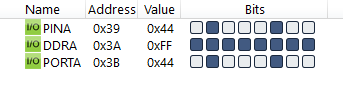

#### *2. Write an AVR C program to send hex values for ASCII characters of 0, 1, 2, 3, 4, 5, A, B, C, and D to Port A.*

```c
#include <avr/io.h>

int main(void)
{
	DDRA = 0xFF;
	unsigned char i, arr[] = "012345ABCD";
	for (i = 0; i < 10; i++)
		PORTA = arr[i];
	return 0;
}
```

