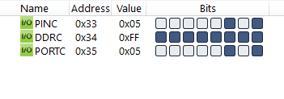

#### *3. Write an AVR C Program to send numbers from -5 to +5 on Port C.*

```c 
#include <avr/io.h>

int main(void)
{
    DDRC = 0xFF;
    char arr[] = {-5, -4, -3, -2, -1, 0, 1, 2, 3, 4, 5};
    unsigned char i;
    for (i = 0; i <= 10; i++)
        PORTC = arr[i];
    return 0;
}
```
 
