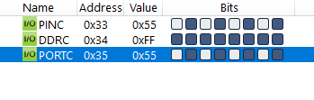
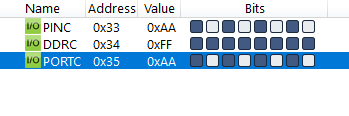

#### *4. Write an AVR C Program to compliment Port C 200 times. (Note: Only show output of two values)*

```c
#include <avr/io.h>

int main(void)
{
    DDRC = 0xFF;
    unsigned char i;
    for (i = 0; i < 200; i++)
        PORTC = ~PORTC;
    return 0;
}
```



