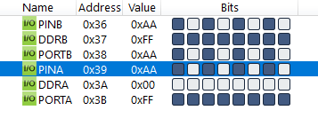
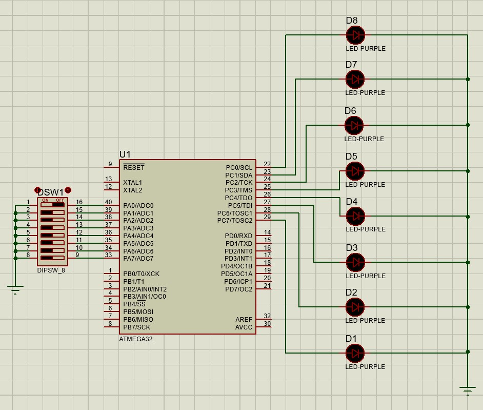

#### *1. Write an AVR C program to get a byte of data from Port A and send it to Port B.*

```c
#include <avr/io.h>

int main(void)
{

	DDRA = 0x00;
	DDRB = 0xFF;
	PORTA = 0xFF;
	while (1)
		PORTB = PINA;
	return 0;
}
```



