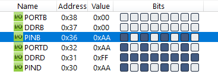

#### *2. Write an AVR C Program to get 10 different values from Port B and send it to Port D (Note: Only show output of two values)*

```c
#include <avr/io.h>

int main(void)
{

	DDRB = 0x00;
	DDRD = 0xFF;

	unsigned char i;
	for (i = 0; i < 10; i++)
		PORTD = PINB;
	return 0;
}
```

