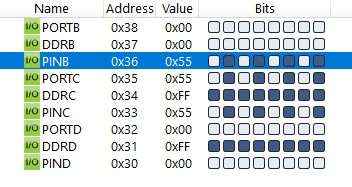
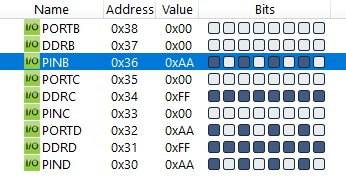

#### *3. Write an AVR C Program to take the value from Port B if the value is less than 100 give it to Port C otherwise to port D.*

```c
#include <avr/io.h>

int main(void)
{
	DDRB = 0x00;
	DDRC = 0xFF;
	DDRD = 0xFF;

	while (1)
	{
		if (PINB < 100)
			PORTC = PINB;
		else
			PORTD = PINB;
	}

	return 0;
}
```



