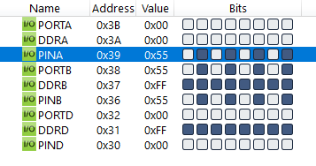
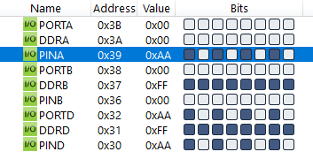

#### *4. Write an AVR C Program to get a value from Port A. If the value is positive send it to Port B otherwise send it to Port D.*

```c
#include <avr/io.h>

int main(void)
{
    DDRA = 0x00;
    DDRB = 0xFF;
    DDRD = 0xFF;
    while (1)
    {
        if (PINA < 128)
            PORTB = PINA;
        else
            PORTD = PINA;
    }
    return 0;
}
```



