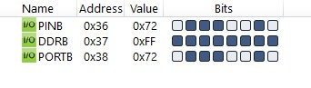

#### *5. Write an AVR C Program to send the ASCII value of your name on Port B.*

```c
#include <avr/io.h>

int main(void)
{
    DDRB = 0xFF;
    unsigned char i;
    unsigned char arr[] = "jayparmar";
    for (i = 0; i < sizeof(arr)/sizeof(arr[0]); i++)
        PORTB = arr[i];
    return 0;
}
```

