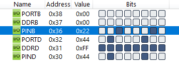

#### *1. Write an AVR C Program to take input value from PORTB. Multiply this content by 2 and give it to PORTD.*

```c
#include <avr/io.h>

int main(void)
{
    DDRB = 0x00;
    DDRD = 0xFF;
    while (1)
        PORTD = PINB * 2;
    return 0;
}
```

