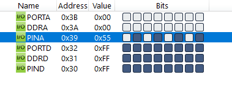

#### *2. Write an AVR C Program to take input from PORTA. Perform logical OR operation between given input value and 0xAA. Give the answer to PORTD.*

```c
#include <avr/io.h>

int main(void)
{
	DDRA = 0x00;
	DDRD = 0xFF;
	while (1)
		PORTD = PINA | 0xAA;
	return 0;
}
```

