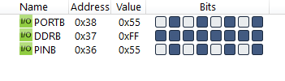
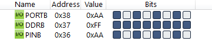

#### *3. Write an AVR C Program to compliment the PORTB with delay of 100ms continuously.*

```c
#include <avr/io.h>
#include <util/delay.h>

int main(void)
{
    DDRB = 0xFF;
    while (1)
    {
        PORTB = ~PORTB;
        _delay_ms(100);
    }
    return 0;
}
```



