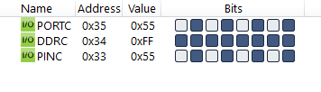
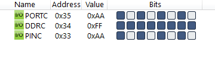

#### *4. Write an AVR C Program to continuously give 0x55 and 0xAA to PORTC. There should be delay of 100ms between each value.*

```c
#include <avr/io.h>
#include <util/delay.h>

int main(void)
{
    DDRC = 0xFF;
    while (1)
    {
        PORTC = 0x55;
        _delay_ms(100);
        PORTC = 0xAA;
        _delay_ms(100);
    }
    return 0;
}
```



