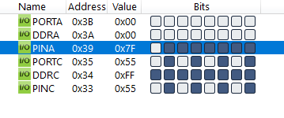
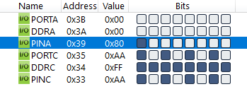

#### *5. Write an AVR C Program to continuously monitor PORTA. If the value is Positive Blink the LEDs connected to bit Position D0, D2, D4 and D6 of PORTC. Otherwise blink the LEDs connected to bit position D1, D3, D5 and D7 of PORTC.*

```c
#include <avr/io.h>
#include <util/delay.h>

int main(void)
{
    DDRA = 0x00;
    DDRC = 0xFF;
    while (1)
    {
        if (PINA < 128)
            PORTC = 0x55;
        else
            PORTC = 0xAA;
        _delay_ms(1000);
        PORTC = 0x00;
        _delay_ms(1000);
    }
    return 0;
}
```



