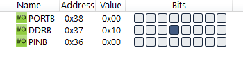
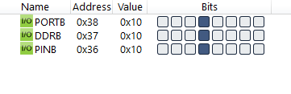

#### *1. Write an AVR C program to continuously toggle only bit 4 of PORTB.*

```c
#include <avr/io.h>
#include <util/delay.h>

int main(void)
{
    DDRB = DDRB | 0b00010000;
    while (1)
    {
        PORTB = PORTB | 0b00010000;
        _delay_ms(200);
        PORTB = PORTB & 0b11101111;
        _delay_ms(200);
    }
    return 0;
}
```



