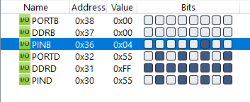
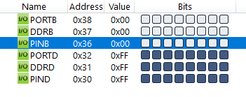

#### *2. Write an AVR C program to monitor bit 2 of PORTB. If it is HIGH send 55H to PORTD. Otherwise Send FFH to PORTD.*

---
```c
#include <avr/io.h>

int main(void)
{
    DDRB = DDRB & 0b11111011;
    DDRD = 0xFF;
    while (1)
        if(PINB & 0b00000100)
            PORTD = 0x55;
        else
            PORTD = 0xFF;
    return 0;
}
```
---



