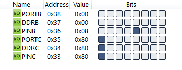

#### *4. Write an AVR C program to continuously get the status of pin 3 of port B and send it to pin 7 of port C.*

```c
#include <avr/io.h>

int main(void)
{
	DDRB = DDRB & 0b11110111;
	DDRC = DDRC | 0b10000000;
	while (1)
	{
		if (PINB & 0b00001000)
			PORTC = PORTC | 0b10000000;
		else
			PORTC = PORTC & 0b01111111;
	}
	return 0;
}
```



