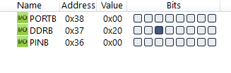
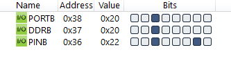

#### *5. A door sensor is connected to bit1 of PORT B. When door is open it generates LOW. Write an AVR C program to Turn on the LED connected to bit5 of PORTB when door is closed. Otherwise turn off the LED.*

```c
#include <avr/io.h>

int main(void)
{
    DDRB = DDRB & 0b11111101;
    DDRB = DDRB | 0b00100000;
	while (1)
		if (PINB & 0b00000010)
			PORTB = PORTB | 0b00100000;
		else
			PORTB = PORTB & 0b11011111;
	return 0;
}
```



